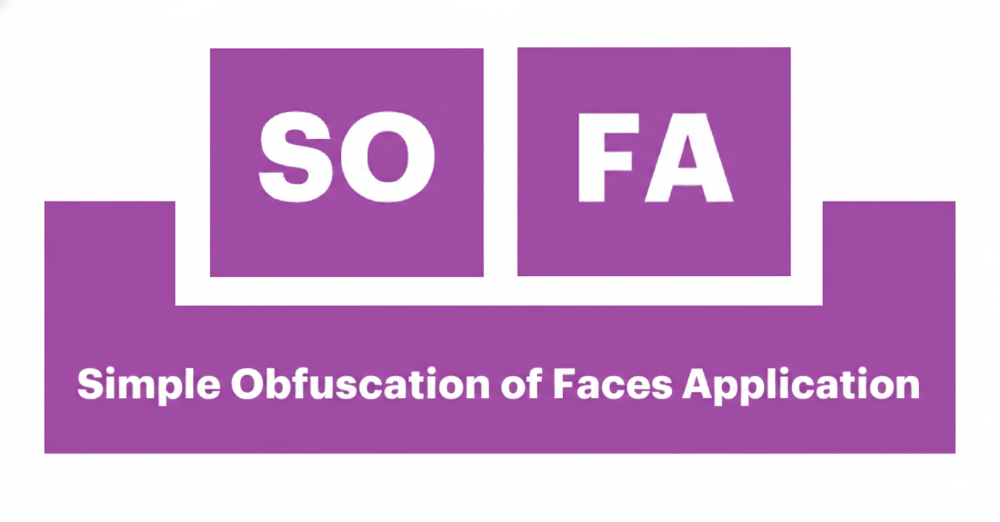
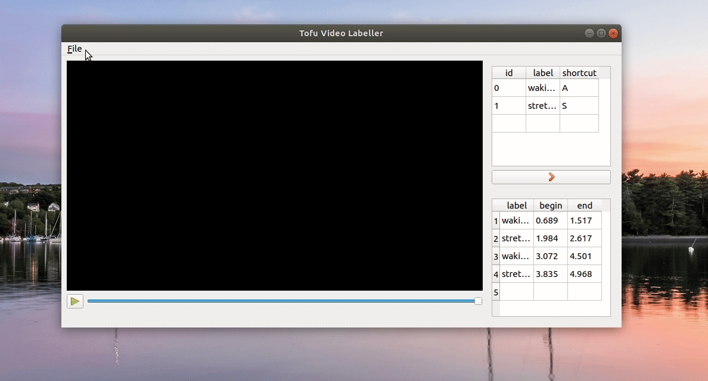

# SOFA - Simple Obfuscation of Faces Application


<p align="center">
  
</p>

SOFA is a minimalist desktop tool for **removing faces from videos** and managing video clips. It uses a lightweight ONNX-based face detection model to automatically detect and blur faces, then provides an intuitive interface for reviewing results and exporting clean clips.

## Features

- **Automatic face detection and blurring** using an UltraLight ONNX model
- **Video playback** with speed control, seeking, and keyboard shortcuts
- **Clip management** -- mark and export video segments with faces removed
- **Metadata visualization** -- highlight suspicious frames on the timeline
- Dark-themed UI built with PyQt5

## Screenshots

| Opening a video | Labelling clips | Exporting |
|:-:|:-:|:-:|
|  |  |  |

## Installation

### Prerequisites

- **Python 3.10 - 3.12**
- [**uv**](https://docs.astral.sh/uv/) -- fast Python package manager

#### System dependencies (Linux only)

For MP4 and proprietary video format support on Ubuntu/Debian:

```bash
sudo apt install ubuntu-restricted-extras
sudo apt install build-essential qt5-default
sudo apt install libgstreamer1.0-0 gstreamer1.0-plugins-base \
  gstreamer1.0-plugins-good gstreamer1.0-plugins-bad \
  gstreamer1.0-plugins-ugly gstreamer1.0-libav \
  gstreamer1.0-tools gstreamer1.0-x gstreamer1.0-alsa \
  gstreamer1.0-gl gstreamer1.0-gtk3 gstreamer1.0-qt5 \
  gstreamer1.0-pulseaudio
```

### Setup

```bash
# Clone the repository
git clone https://github.com/<your-username>/sofa.git
cd sofa

# Install all dependencies (creates a virtual environment automatically)
uv sync
```

That's it. `uv` handles Python version management, virtual environment creation, and dependency installation in a single command.

## Usage

### GUI Application

```bash
# Run via the installed entry point
uv run sofa

# Or run the module directly
uv run python -m src.main
```

### CLI Face Blurring

You can also blur faces from the command line without the GUI:

```bash
uv run python -m src.face_recog -i input_video.mp4 -o output_video.mp4
```

### Keyboard Shortcuts

| Key | Action |
|-----|--------|
| `Space` | Play / Pause |
| `Up` | Speed up |
| `Down` | Slow down |
| `Right` | Skip forward 10s |
| `Left` | Skip back 10s |
| `C` | Create clip mark |
| `Ctrl+O` | Open video |
| `Ctrl+S` | Save clips |
| `Ctrl+Q` | Exit |

## Development

```bash
# Install with dev dependencies
uv sync

# Lint and check code
uv run ruff check src/

# Auto-format code
uv run ruff format src/
```

## Project Structure

```
sofa/
├── pyproject.toml          # Project metadata and dependencies
├── models/
│   └── ultra_light_640.onnx  # Pre-trained face detection model
├── src/
│   ├── __init__.py
│   ├── main.py             # Application entry point
│   ├── video_window.py     # Main window and video player
│   ├── face_recog.py       # Face detection and blurring engine
│   ├── bad_clips_slider.py # Timeline highlight widgets
│   ├── bad_clips_table.py  # Clip management table
│   ├── proc_bar_dialog.py  # Processing progress dialog
│   ├── signals.py          # Qt signal bus (singleton)
│   ├── utils.py            # Utility functions
│   └── static/img/         # Application icons
└── doc/static/img/         # Documentation assets
```

## License

This project is licensed under the **GNU General Public License v3.0** -- see the [LICENSE](LICENSE) file for details.
